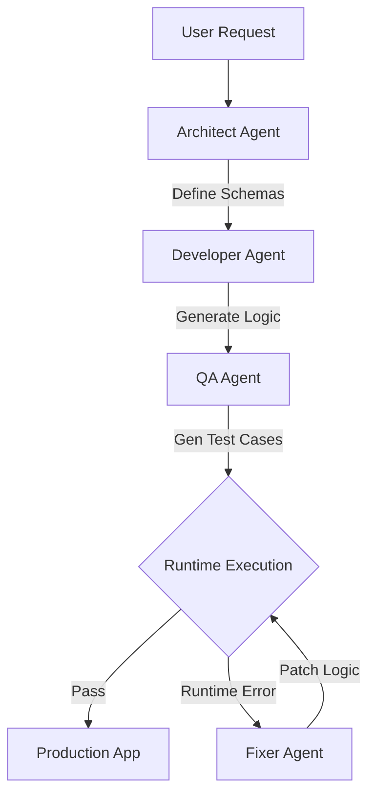

Here is an incredibly detailed `README.md` for your project. It documents the architecture, the custom DSL, the agentic workflow, and the self-healing capabilities demonstrated in your logs.

***

# Meta-AI: Self-Healing GenAI Software Factory


**Meta-AI** is a proof-of-concept autonomous software factory written in Rust. It accepts high-level natural language user requests and orchestrates a swarm of AI agents to **Architect**, **Develop**, **Test**, and **Fix** a custom application executable within a safe, sandboxed runtime.

Its defining feature is **Self-Healing Logic**: If the generated program crashes during QA testing (e.g., division by zero), the system autonomously analyzes the stack trace, patches the logic, and re-verifies the fix before deploying to production.

---

## 📑 Table of Contents

- [How It Works](#-how-it-works)
- [The Agent Swarm](#-the-agent-swarm)
- [The Domain Specific Language (DSL)](#-the-json-logic-dsl)
- [Self-Healing Showcase](#-showcase-self-healing-in-action)
- [Installation & Usage](#-installation--usage)
- [Project Structure](#-project-structure)
- [Technical Architecture](#-technical-architecture)

---

## 🧠 How It Works

Meta-AI does not generate Python or Rust code directly. Instead, it generates a strict **JSON-based Logic Program** that runs inside a custom Rust interpreter (`src/core/runtime.rs`). This ensures safety, structure, and deterministic execution.

### The Lifecycle

1. **User Request:** You describe a tool (e.g., *"Make a profit calculator"*).
2. **Phase 1: Architecture:** An AI Agent defines the Input/Output JSON Schemas.
3. **Phase 2: Development:** An AI Developer writes the logic steps using the Meta-AI DSL.
4. **Phase 3: QA & Testing:** An AI QA Engineer generates diverse test cases (Happy Path, Edge Cases, Complex Logic).
5. **Validation Loop:**
    - The Runtime executes the logic against the test cases.
    - ❌ **If it fails:** The **Fixer Agent** is summoned. It reads the error log, modifies the JSON logic, and retries.
    - ✅ **If it passes:** The program is marked ready for production.



---

## 🤖 The Agent Swarm

The system utilizes Google's Gemini Flash model via the `reqwest` library. The logic is encapsulated in `src/ai/agents.rs`.

| Agent | Role | Responsibility |
| :--- | :--- | :--- |
| **Architect** | `System Design` | Defines strict JSON Schemas for Inputs and Outputs. Determines the data structure. |
| **Developer** | `Implementation` | Translates the requirements into a sequential JSON Logic array (`LogicStep`). |
| **QA Engineer** | `Testing` | Generates hostile inputs (e.g., Empty arrays, Zero values, High precision floats) to break the code. |
| **Fixer** | `Debugging` | Triggered only on failure. Analyzes the Rust Runtime error (e.g., `Pointer not found`, `Division by zero`) and rewrites the logic steps. |

---

## ⚡ The JSON Logic DSL

Meta-AI defines its own programming language in `src/core/dsl.rs`. It is a linear sequence of atomic operations.

### Operation Types

The language supports various operations defined in the `LogicOp` enum:

- **Data Access:** `Get`, `Constant`, `Pluck` (extract fields from lists).
- **Math:** `Add`, `Subtract`, `Multiply`, `Divide`, `Calculate` (math on array items).
- **Aggregations:** `Sum`, `Min`, `Max`, `Count`.
- **Control Flow:** `FilterNumeric`, `Sort`.
- **Formatting:** `FormatString` (template interpolation).

### Example Logic Step

This is what the AI generates to calculate overhead costs:

```json
{
  "id": "calc_overhead",
  "description": "Calculate total overhead (Hours * Rate)",
  "operation": {
    "op": "multiply",
    "a": "/total_hours",
    "b": "/overhead_rate"
  },
  "output_path": "/total_overhead_cost"
}
```

---

## 🛡 Showcase: Self-Healing in Action

*Based on actual execution logs.*

**The Scenario:** A user asked for a Project Profitability tool.
**The Bug:** The QA Agent generated a test case with **$0 Revenue**. The Developer Agent's logic calculated margin as `Profit / Revenue`.
**The Crash:** `Runtime Logic Error: Division by zero`.

### The Auto-Fix

The **Fixer Agent** intercepted the crash, analyzed the math, and rewrote the logic to include an epsilon offset for safety:

**Before (Crashes on 0):**

```json
{ "op": "divide", "a": "/total_profit", "b": "/total_revenue" }
```

**After (Fixer Patch):**

```json
[
  {
    "id": "const_epsilon",
    "operation": { "op": "constant", "value": 1e-12 },
    "output_path": "/safe_denom_offset"
  },
  {
    "id": "calc_safe_revenue",
    "operation": { "op": "add", "a": "/total_revenue", "b": "/safe_denom_offset" },
    "output_path": "/safe_total_revenue"
  },
  {
    "id": "calc_margin",
    "operation": { "op": "divide", "a": "/total_profit", "b": "/safe_total_revenue" },
    "output_path": "/profit_margin"
  }
]
```

*The system autonomously patched the math to prevent the crash and successfully deployed the app.*

---

## 🚀 Installation & Usage

### Prerequisites

* Rust (latest stable)
- A Google Gemini API Key

### Setup

1. **Clone the repository:**

    ```bash
    git clone https://github.com/hoahbclarkson/meta-ai.git
    cd meta-ai
    ```

2. **Configure Environment:**
    Create a `.env` file in the root directory:

    ```env
    GEMINI_API_KEY=your_api_key_here
    RUST_LOG=info
    ```

3. **Run:**

    ```bash
    cargo run
    ```

4. **Modify Requests:**
    Open `src/main.rs` and change the `prompt` variable string to build different applications (e.g., "Build a tax calculator", "Analyze student grades").

---

## 📂 Project Structure

```text
meta-ai
├── src
│   ├── ai
│   │   ├── agents.rs       # Definition of Architect, Dev, QA, Fixer
│   │   ├── client.rs       # HTTP Client for Gemini API
│   │   ├── prompts.rs      # System prompts (Strict Mode instructions)
│   │   └── schema_utils.rs # JSON Schema cleaning/recursion handling
│   ├── core
│   │   ├── dsl.rs          # The Language Definition (Structs/Enums)
│   │   └── runtime.rs      # The Interpreter / Virtual Machine
│   ├── orchestrator.rs     # The main loop (Dev -> Test -> Fix)
│   └── main.rs             # Entry point
├── llm_response_*.json     # Debug logs of AI responses
└── Cargo.toml              # Dependencies
```

---

## 🏗 Technical Architecture

### 1. Robust Runtime (`runtime.rs`)

The runtime is designed to be resilient. It includes a "Smart Pointer" system. If the AI generates logic asking for `/projects` but the data is stored at `/inputs/projects`, the runtime automatically detects the discrepancy and resolves the path correctly.

### 2. Recursive Schema Cleaning (`schema_utils.rs`)

LLMs often struggle with deep JSON Schema definitions ($defs, recursive refs). This utility flattens and sanitizes schemas before sending them to the LLM, ensuring higher compliance with strict JSON generation.

### 3. Strict Mode & Logic Guidance

The system uses a hybrid approach to prompting.
- **Architecture Phase:** Uses Google's "Strict Mode" (constrained decoding) to guarantee valid JSON Schema output.
- **Logic Phase:** Uses open-ended generation with rigid few-shot examples to handle complex recursive logic structures (like `FormatString` variable arrays) that standard schemas struggle to describe to an LLM.

---

## License

This project is licensed under the MIT License - see the LICENSE file for details.
